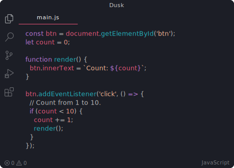

### Hi there, I'm Benjamin! 👋

I mostly do WebDev with Vue, Tailwind, Laravel and PHP.

    

Some of my currently most important projects are the following:

 

Sometimes I write stuff on my blog: https://darkshark9k.ml

My Visual Studio Code Theme is [Dusk](https://vscodethemes.com/e/pilleye.dusk-theme/dusk?language=javascript):

If you want to contact me, you can find my contact information on the about section of my blog: https://darkshark9k.ml
